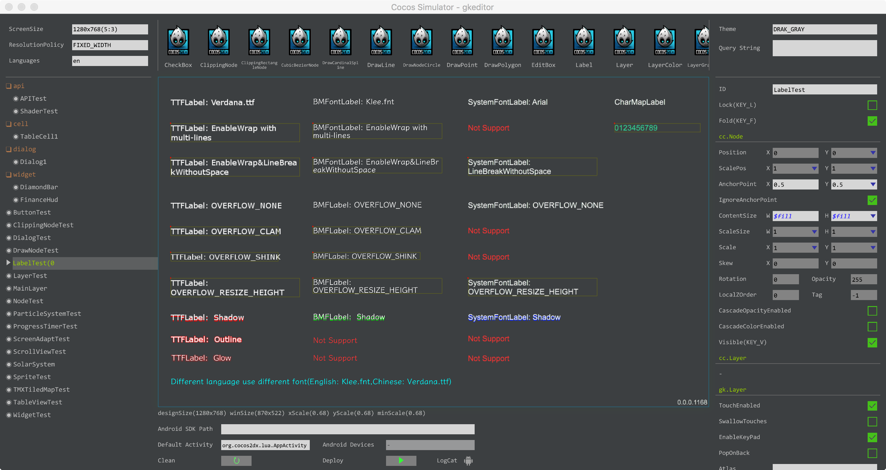
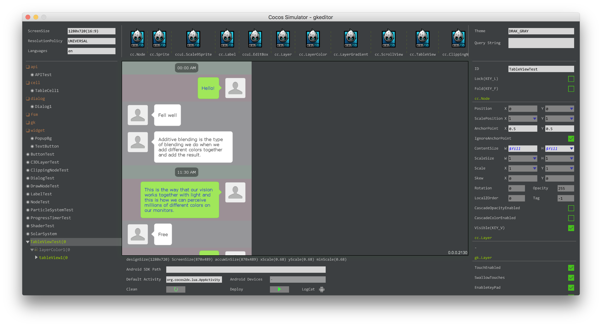
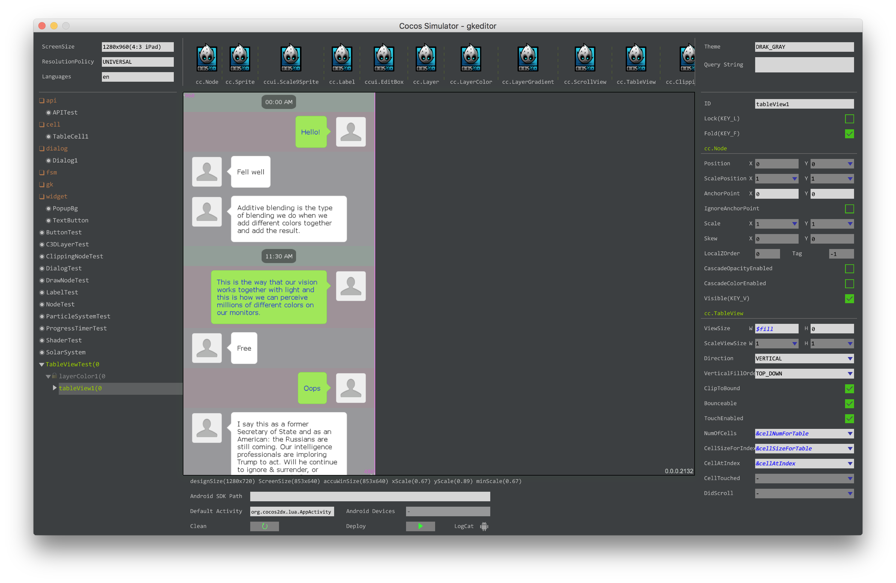
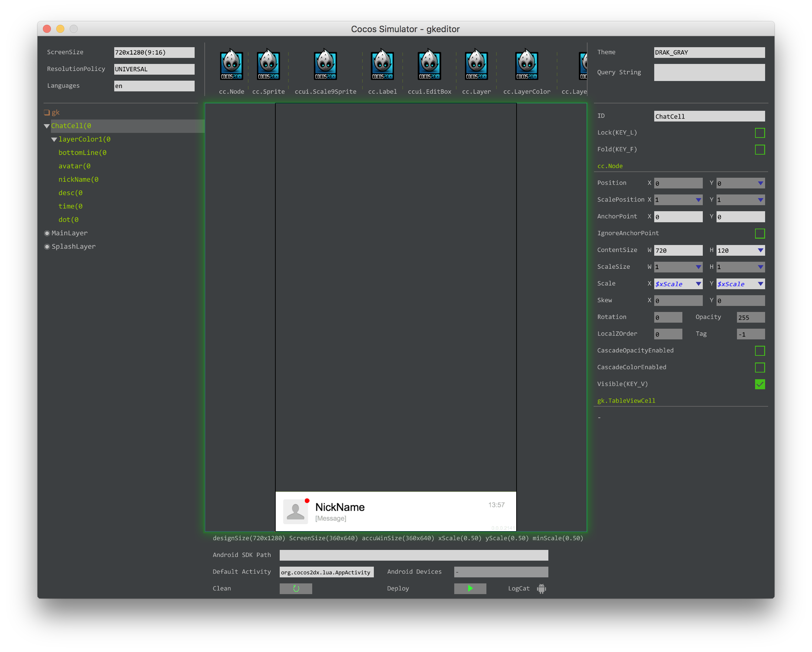

# cocos2dx-lua-ui-editor
A lightweight ui editor for cocos2d-x-lua implemented by pure lua code, less than 10000 lines of code.

[](https://github.com/Tencent/xLua/blob/master/LICENSE.TXT)

### LabelTest

### TableViewTest on ScreenSize 1280x720

### TableViewTest on ScreenSize 1280x960


## Features
 * No dependency except cocos2d-x-lua lib (Tested on 3.15).
 * Instance Run&Edit on Mac, F1:EditMode, F2:ReleaseMode(Editing node), F3:ReleaseMode, Hot deploy on Android Device.
 * Support almost all cocos2d-x nodes and lots of custom nodes.
 * 4 root containers: gk.Layer, gk.Dialog, gk.Widget, gk.TableViewCell.
 * Completely compatible with ui created by code.
 * Layout files are generated as lua code, no parser.
 * Screen adapt policy: FIXED_WIDTH, FIXED_HEIGHT, UNIVERSAL(Scale coordinates and nodes separately), support iPhoneX.
 * FSM Editor, BehaviorTree Editor;
  
 ## How to use
 1. Create an empty lua-project by cocos2d-x 3.15.
 2. Copy "gk/" dir to "src/".
 3. Init gamekit correctly.
 4. Build app and run by Xcode, then you can directly run use "runtime/mac/&lt;youapp&gt;.app".

## Example
* Create a file and Class named ChatCell, refresh Editor by F1.
```lua
local ChatCell = class("ChatCell", gk.TableViewCell)

return ChatCell
```

* Edit the layout in editor.


* Inflate cell just by one line code.
```lua
local cell = gk.injector:inflateNode("demoapp.ChatCell")
```

* Auto generated layout code.
```lua
-- demoapp/gen/layout/demoapp_chatcell.lua
return {
	_id = "ChatCell",
	_type = "ChatCell",
	height = 120,
	scaleX = "$xScale",
	scaleY = "$xScale",
	width = 720,
	anchor = {
	   x = 0,
	   y = 0},
	_children = {	   {
	      _id = "layerColor1",
	      _type = "cc.LayerColor",
	      height = "$fill",
	      width = "$fill",
	      _children = {	         {
	            _id = "bottomLine",
	            _type = "cc.LayerColor",
	            color = "f0f0f0ff",
	            height = 1,
	            width = "$fill"},
	         {
	            _id = "avatar",
	            _type = "cc.Sprite",
	            file = "main/avatar.png",
	            x = 61,
	            y = 60},
	         {
	            _id = "nickName",
	            _type = "cc.Label",
	            color = "000000",
	            fontSize = 32,
	            height = 0,
	            string = "NickName",
	            width = 0,
	            x = 120,
	            y = 74,
	            anchor = {
	               x = 0,
	               y = 0.5}},
	         {
	            _id = "desc",
	            _type = "cc.Label",
	            color = "a6a6a6",
	            enableWrap = true,
	            fontSize = 20,
	            height = 0,
	            overflow = 2,
	            string = "[Message]",
	            width = 500,
	            x = 120,
	            y = 40,
	            anchor = {
	               x = 0,
	               y = 0.5}},
	         {
	            _id = "time",
	            _type = "cc.Label",
	            color = "a6a6a6",
	            fontSize = 20,
	            height = 0,
	            string = "13:57",
	            width = 0,
	            x = 686,
	            y = 80,
	            anchor = {
	               x = 1,
	               y = 0.5}},
	         {
	            _id = "dot",
	            _type = "cc.Sprite",
	            color = "ff0000",
	            file = "main/dot.png",
	            x = 95,
	            y = 93}}}}}
```

 ## TODO
 * Dynamic inflate nodes when needed :)
 * 3D support, but the cocos3D is too weak :(
 * Document. 
